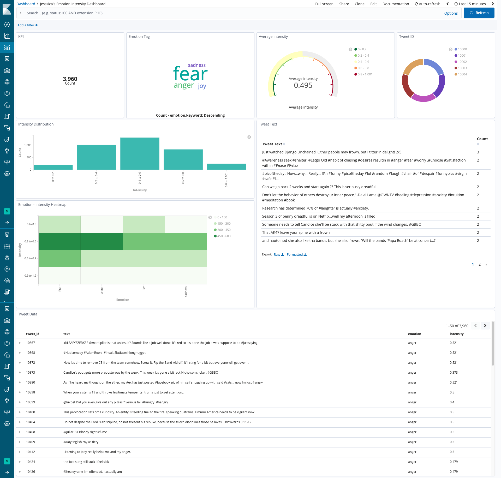

# jessica_emoint

```bash
docker pull gaoyuanliang/jessica_emoint:1.0.1

docker run -it \
-p 6744:6744 \
-p 7765:7765 \
gaoyuanliang/jessica_emoint:1.0.1
```

view the dashboard at: http://0.0.0.0:7765/app/kibana#/dashboard/6b8c0960-3c4d-11eb-be47-e5c942925dc2



## reference 

https://keras.io/examples/nlp/text_classification_from_scratch/

http://saifmohammad.com/WebPages/EmotionIntensity-SharedTask.html
